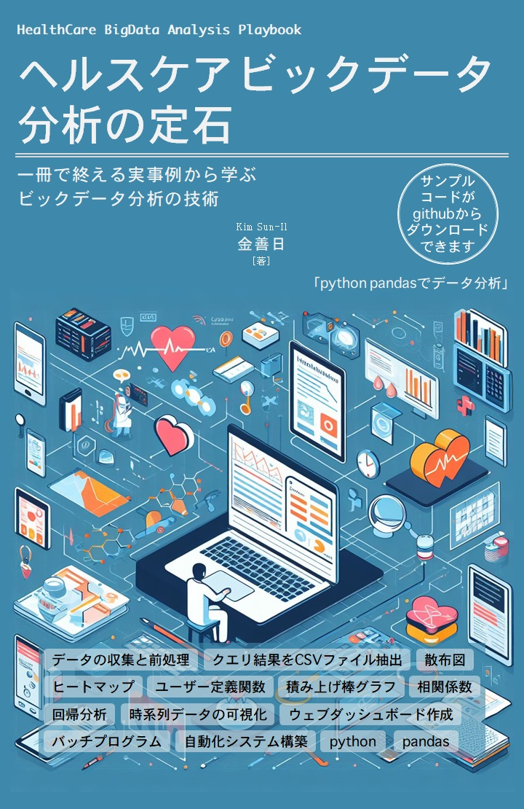

# HealthCare BigData Analysis Playbook Japan, 1st Edition

こんにちは！『ヘルスケアビックデータ分析の定石』の著者「金善日(Kim SunIl)」です。
* [著者のfacebook](https://www.facebook.com/sunil.kim.98)

 

## 『ヘルスケアビックデータ分析の定石』書籍紹介

* [Amazonのペーパーバック](https://www.amazon.co.jp/dp/B0CLN3LBVP)
* [AmazonのKindle](https://www.amazon.co.jp/dp/B0CLTZ5YP2)

 
 

以下のは、章別のサンプルコードです。
## 章別のIPythonノートブックファイル:
* [4章:Pythonの基本構文と組み込みデータ型](https://github.com/suninno/healthcare_bigdata_playbook_jp/tree/main/ch04)
* [5章 NumPyの基礎と活用](https://github.com/suninno/healthcare_bigdata_playbook_jp/tree/main/ch05)
* [6章: pandasの基礎](https://github.com/suninno/healthcare_bigdata_playbook_jp/tree/main/ch06)
* [7章: pandasの活用](https://github.com/suninno/healthcare_bigdata_playbook_jp/tree/main/ch07)
* [8章: データの収集と前処理](https://github.com/suninno/healthcare_bigdata_playbook_jp/tree/main/ch08)
* [9章 事例#1：データの可視化](https://github.com/suninno/healthcare_bigdata_playbook_jp/tree/main/ch09)
* [10章 事例#2：時系列データの扱い](https://github.com/suninno/healthcare_bigdata_playbook_jp/tree/main/ch10)
* [11章 事例#3：積み上げ棒グラフと回帰分析の実践](https://github.com/suninno/healthcare_bigdata_playbook_jp/tree/main/ch11)
* [12章 自動化とウェブダッシュボードの作成](https://github.com/suninno/healthcare_bigdata_playbook_jp/tree/main/ch12)

